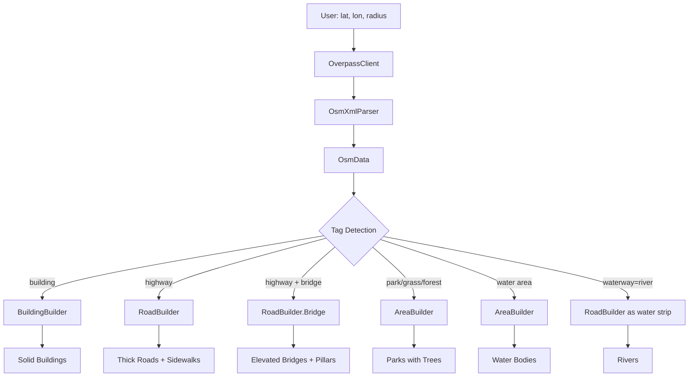

# GeoCity3D Architecture

High-level overview of the codebase for developers and contributors.

## Pipeline

```
User Input → Overpass API → XML → OsmData → Geometry Builders → Unity GameObjects
```

1. **Fetch** — `OverpassClient` downloads raw XML from the Overpass API for the specified lat/lon/radius.
2. **Parse** — `OsmXmlParser` converts XML into `OsmData` (nodes, ways, tags).
3. **Convert** — `OriginShifter` transforms WGS84 coordinates into Unity world space using a floating origin.
4. **Generate** — Geometry builders create sealed, volumetric meshes from parsed data.

## Directory Structure

```
Runtime/
├── Coordinates/
│   ├── GeoConverter.cs        — Lat/Lon → Spherical Mercator math
│   └── OriginShifter.cs       — Floating origin for precision
├── Data/
│   └── OsmModels.cs           — OsmNode, OsmWay, OsmData
├── Geometry/
│   ├── BuildingBuilder.cs     — Solid building extrusions
│   ├── RoadBuilder.cs         — Roads, sidewalks, bridges
│   ├── AreaBuilder.cs         — Parks, water bodies (polygons)
│   ├── TreeBuilder.cs         — Sphere canopy + grounded trunk
│   ├── GroundBuilder.cs       — Raised platform base
│   └── GeometryUtils.cs       — Ear-clipping triangulation
├── Network/
│   └── OverpassClient.cs      — HTTP requests
├── Parsing/
│   └── OsmXmlParser.cs        — XML → OsmData
└── CityController.cs          — Runtime configuration

Editor/
├── CityGeneratorWindow.cs     — Main editor window + generation logic
├── DemoSetup.cs               — Quick-start demo scene setup
└── SimpleEditorCoroutine.cs   — Editor coroutine runner
```

## Geometry Builders

### BuildingBuilder
- Creates **solid sealed extrusions**: outer walls + full roof cap + bottom cap
- Consistent CCW winding enforced on all footprints
- Height from `building:levels`, `height` tags, or type-based estimation
- Supports pitched roofs, flat roofs with parapets, and setbacks for tall buildings
- MeshCollider for accurate collision
- Sub-meshes: wall material (index 0), roof material (index 1)

### RoadBuilder
- Roads with **visible thickness**: top surface + side walls + end caps + bottom
- **Bridge detection**: `bridge=yes` tag → elevated deck (5m) + railings + support pillars
- Width by highway type: motorway 12m, primary 10m, residential 6m, footway 2m
- Sidewalks on roads ≥4m wide (not footways/paths)

### AreaBuilder
- Triangulated polygon top surface + **perimeter side walls** (0.10m edge depth)
- Used for parks (`landuse=park/grass/forest`), water (`natural=water`), and other areas

### TreeBuilder
- **Grounded cylinder trunk** with base disc + top disc (8 segments, tapered)
- **Smooth sphere canopy** (12 rings × 10 segments)
- `ScatterTrees` for park filling, individual `Build` for street trees
- 4 dark-green canopy color variations

### GroundBuilder
- Raised platform base with proportional height
- Top surface + 4 side walls + bottom cap
- Separate materials for top and sides

## Data Flow



## Material System

All materials are **solid color, double-sided, opaque**:
- `_Cull = 0` (renders both sides — no see-through geometry)
- `renderQueue = 2000` (geometry queue)
- Auto-detects shader: URP Lit → HDRP Lit → Standard → Diffuse

| Element | Color | Smoothness |
|---------|-------|------------|
| Buildings | Light gray `#C8C8C8` | 0.3 |
| Roofs | Slightly darker gray | 0.2 |
| Roads | Dark charcoal `#2D2D2D` | 0.5 |
| Sidewalks | Medium gray | 0.3 |
| Parks | Vibrant green `#1A7A1A` | 0.2 |
| Water | Dark teal `#1A4A4A` | 0.7 |
| Platform | Dark gray | 0.3 |

## Key Design Decisions

1. **Solid extrusions over hollow shells** — buildings are simple closed polygons extruded upward with sealed caps, not thin shells with wall thickness. Simpler, more robust, better looking.
2. **sharedMesh everywhere** — avoids mesh leak warnings in edit mode.
3. **Double-sided materials** — safety net against any winding issues. Geometry never disappears.
4. **No textures** — architectural maquette aesthetic uses solid colors for clean, professional look.
5. **Bridge as special road case** — detected via OSM tags, same builder, different geometry path.
